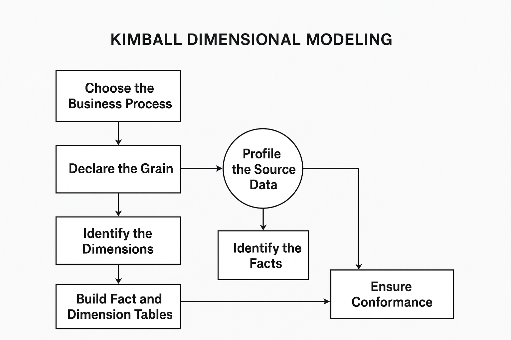

# Personal Data Project

In this project, I'll demonstrate part of my knowledge of data manipulation and handling.

This project will be built in a step-by-step method, with each step adding more complexity and covering different aspects of a typical real-world data handling project.

I'll explain different aspects from basic to advanced, from IDE setup to Big Data handling techniques.

Yes, Chat-GPT will be used as a serving tool only—for example, for creating dummy data files and suggesting steps to accomplish tasks. During the process, I'll provide different links and online material/documentation explaining exactly how to understand the subject and how to solve problems independently.

## Chapter I
### What's our challenge?

The NBA, the most popular basketball league in the world, will serve as the basis for creating a data platform to analyze games, players, and coaches' statistics.

### OLTP Source System

The OLTP (Online Transactional Processing) system will consist of several CSV files representing the operational source system:

- **teams.csv**: Basic info about NBA teams.  
  *Columns*: `team_id`, `team_name`, `city`, `arena`

- **players.csv**: Roster information for players.  
  *Columns*: `player_id`, `player_name`, `team_id`, `position`, `height`, `weight`, `age`

- **games.csv**: Schedule of games played.  
  *Columns*: `game_id`, `season`, `date`, `home_team_id`, `away_team_id`, `arena`

- **game_stats.csv**: Transactional stats for each player per game (typical OLTP).  
  *Columns*: `stat_id`, `game_id`, `player_id`, `points`, `rebounds`, `assists`, `steals`, `blocks`, `minutes_played`

- **coaches.csv** (optional, adds flavor):  
  *Columns*: `coach_id`, `coach_name`, `team_id`, `role`

### Starting Business Process

The source OLTP files are placed into the `data/source_files` folder. A `documentation` folder is also included within `data/source_files` to store any relevant metadata or descriptions for the source files.

### Folder Structure

Below is the folder structure for the project:
```data_project 
├── data 
│ ├── source_files 
│ │ ├── teams.csv 
│ │ ├── players.csv 
│ │ ├── games.csv 
│ │ ├── game_stats.csv 
│ │ └── coaches.csv
├── documentation  
├── README.md
```

### Dimensional Modeling
Great, we have a basic source folder structure, we have our source files, now what ?!

As a reminder our goal is to have a full operating data platform to analyze the different aspects of the NBA league, we need to have a clear, standardized method to identify, prepare, understand the business aspects, and creating the data platform.

One of the most popular and still relevant to date data modeling for OLAP (Online Analytics processing) is Ralph's Kimball Dimensional modeling ([Kimball Group](https://www.kimballgroup.com/)) , this approach created in the mid 80's was the evolution of the DataWarehouse Modeling system, developed by ([Bill Inmon](https://www.linkedin.com/in/billinmon)) in the early 80's, separating the OLTP source and landing relevent data into a single Operational Data Store, was main aspects which balance the demand of analyzing the source data and delivering it analytics, data was modeled as 3rd normal form, mainly leaving it Highly Normalized resemble to the OLTP model.

The Dimensional Model Methodology, took the DataWarehouse to next step, allowing for setting clear, standardized steps to translating business requirements, model the data, and developing the solution to support the requirements.

🔹 Steps to Kimball Dimensional Modeling (with Parallel Profiling)
1. Choose the Business Process

Define the scope (e.g., Player Game Stats, Ticket Sales, Team Performance).

This anchors your modeling effort.

2. Declare the Grain

Decide the level of detail for the fact table.

Example: one row per player per game.

3–5. Iterative Loop: Grain ↔ Profiling ↔ Dimensions ↔ Facts

Run these in parallel/iterative mode:

🔹 Step A: Profile the Source Data

Explore OLTP schema, data types, distributions, anomalies.

Check keys, relationships, nulls, duplicates, outliers.

Example: discover height stored as string (6-10) → decide how to model it.

🔹 Step B: Identify Dimensions

Candidate descriptive attributes (Player, Team, Date, Arena).

Profiling validates which attributes are stable and useful.

🔹 Step C: Identify Facts

Candidate numeric measures (Points, Rebounds, Assists, Revenue).

Profiling confirms which ones are additive and at what grain.

👉 Feedback Loop: Profiling informs grain choice, dimension attributes, and fact measures — and vice versa.

6. Build Fact and Dimension Tables

Implement fact table (foreign keys + measures).

Implement dimension tables (denormalized descriptive data).

Example: Fact_PlayerGameStats with points, rebounds, assists, etc., linked to Dim_Player, Dim_Team, Dim_Date.

7. Ensure Conformance

Standardize shared dimensions (e.g., one Dim_Date used everywhere).

Ensures integration across multiple fact tables.

8. Iterate

Expand to new business processes.

Add more fact tables and reuse conformed dimensions to build the data warehouse bus.



#### Choose the Business Process
Ok, so step 1, we'll start with declaring the Business Process, so what is the business process ?

***Business processes are the operational activities performed by your organization, such as taking an order, processing an insurance claim, registering students for a class, or snapshotting every account each month. Business process events generate or capture performance metrics that translate into facts in a fact table. Most fact tables focus on the results of a single business process. Choosing the process is important because it defines a specific design target and allows the grain, dimensions, and facts to be declared. Each business process corresponds to a row in the enterprise data warehouse bus matrix.***

Now we understand that the Business Processes are the Actual Events that our organization creates, in our case we'll be interested in the following Business Processes:
1. Player Game Stats - For each Game, each Player will have its own game stats, shoots, scores, etc...  this business process will track of the player game stats.
2. Ticket Sales - Each game 
3. Team Performance

Alright, we have our business process :) , lets continue to declaring the Grain and profiling the data sources steps.

#### Declare The Grain
***Declaring the grain is the pivotal step in a dimensional design. The grain establishes exactly what a single fact table row represents. The grain declaration becomes a binding contract on the design. The grain must be declared before choosing dimensions or facts because every candidate dimension or fact must be consistent with the grain. This consistency enforces a uniformity on all dimensional designs that is critical to BI application performance and ease of use. Atomic grain refers to the lowest level at which data is captured by a given business process. We strongly encourage you to start by focusing on atomic-grained data because it withstands the assault of unpredictable user queries; rolled-up summary grains are important for performance tuning, but they pre-suppose the business’s common questions. Each proposed fact table grain results in a separate physical table; different grains must not be mixed in the same fact table.***

So, in this step we'll address the Business Processes required to support, and we'll define what's the Lowest Level at which data is captured or recorded on the OLTP system, this is a LOGICAL definition, one Business Process might be sourced from multiple source system files/tables that support it.

1. Player Game Stats - 
  so how do we decide on what is the atomic granularity level for the fact ?
  This is where Profiling come in place, we need to dig into the source system and understand sources, tables, fields, etc...

  In order to this i'm bringing in few tools that will help us to understand the sources, in our case the OLTP csv files.

  Since This is the first time we are starting a Technical subject i'll address this as mentioned earlier, a step by step.

  We need an IDE to work on our project files, repo, code files, etc...

  We can use any IDE we prefer, i'm working with ([VSCode](https://code.visualstudio.com/download)) , once you have it installed, install following Extensions:

  - ([Edit CSV](https://marketplace.visualstudio.com/items?itemName=janisdd.vscode-edit-csv))
  - ([GitHub Copilot](https://marketplace.visualstudio.com/items?itemName=GitHub.copilot))
  - ([json](ZainChen.json))
  - ([jupyter](https://marketplace.visualstudio.com/items?itemName=ms-toolsai.jupyter))
  - ([Markdown Preview](https://marketplace.visualstudio.com/items?itemName=shd101wyy.markdown-preview-enhanced))
  - ([Rainbow CSV](https://marketplace.visualstudio.com/items?itemName=mechatroner.rainbow-csv))
  - 