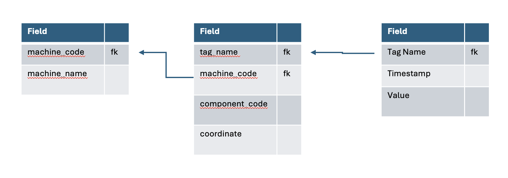

# Hi,

I'm storing all my tech notes , regarding all sort of topics like git, python, etc...

## New RZR Project

In this demo project i'll demonstrate Following procedure:

1. Creating a virtual environment
2. Installing necessary packages
3. Running the application
4. Running the Report

### Project Structure

    .
    ├── rzr                         # main project folder
    ├──── .venv                     # python virtual environment
    ├──── ingestion                 # python application for extracting source data
    ├──── rzr_sql                   # sql folder for reporting
    ├──── rzr_raw_source            # landing source data files
    ├──── rzr_mart                  # rzr transformed data for bi usage
    └── README.md

### virtual environment setup

1. Create a virtual environment

```bash
python -m venv .venv
```

2. Activate the virtual environment

```bash
# On macOS/Linux
source .venv/bin/activate
```

for this project i'll set a requirements.txt file with the necessary packages.

```bash
# On macOS/Linux
pip freeze > requirements.txt
```

3. Install necessary packages - for setting this project

```bash
pip install -r requirements.txt
```

4. Install duckdb for terminal cli

```bash
pip install duckdb
```

### Running the application

#### business requirements gathering

First i will explore the csv source files in \rzr_raw_source folders, we'll check their ddl and
understand what are the fields that each file store and thus decide on their target raw table that will
be loaded into duckdb.

machines

```Text
machine_code - string
machine_name - string
```

sensors

```Text
tag_name - string
machine_code - string
component_code - string
coordinate - string
```

sensor_reads

```Text
Tag Name - string
Timestamp - Timestamp
Value - float
```

looking on these tables schemas we can understand the ERD for rzr system as following:



#### Ingesting the source data

As first step we'll load the content of the source files into duckdb raw tables.
which will be saved in the /rzr_raw folder.

1. Load the sensor_reads csv files into a target raw_sensor_reads table and save as parquet:

```sql
-- Read all CSV files from a folder using wildcards
CREATE OR REPLACE TABLE raw_sensor_reads AS
SELECT *,
       regexp_extract(filename, '([^/]+)\.csv$', 1) as source_file
FROM read_csv_auto('rzr_raw_source/sensor_reads/*.csv');

-- Export to parquet
COPY raw_sensor_reads TO 'rzr_raw/raw_sensor_reads.parquet' (FORMAT PARQUET);
```

2. Load the machines csv files into a target raw_machines table and save as parquet:

```sql
-- Read all CSV files from a folder using wildcards
CREATE OR REPLACE TABLE raw_machines AS
SELECT *,
       regexp_extract(filename, '([^/]+)\.csv$', 1) as source_file
FROM read_csv_auto('rzr_raw_source/machines/*.csv');

-- Export to parquet
COPY raw_machines TO 'rzr_raw/raw_machines.parquet' (FORMAT PARQUET);
```

3. Load the sensors csv files into a target raw_sensors table and save as parquet:

```sql
-- Read all CSV files from a folder using wildcards
CREATE OR REPLACE TABLE raw_sensors AS
SELECT *,
       regexp_extract(filename, '([^/]+)\.csv$', 1) as source_file
FROM read_csv_auto('rzr_raw_source/sensors/*.csv');

-- Export to parquet
COPY raw_sensors TO 'rzr_raw/raw_sensors.parquet' (FORMAT PARQUET);
```

#### running the report
1. lets create a table for the report using following sql:
```sql
CREATE OR REPLACE TABLE rzr_report AS
with src_sensors_read as (
    SELECT
        t.*
    from raw_sensor_reads t
    where
    try(t.Value::double) is not null
),
src_sensors as (
    SELECT
        t.*
    from raw_sensors t
),
src_machines as (
    SELECT
        t.*
    from raw_machines t
),
transform as (
    SELECT
        t.Timestamp::Date as dt_sensor_read,
        t3.machine_name,
        t2.coordinate,
        t.Value::double as value,
    from src_sensors_read t
    inner join src_sensors t2 on t."Tag Name" = t2."tag_name"
    inner join src_machines t3 on t2."machine_code" = t3."machine_code"
),
final as (
    SELECT
        t.dt_sensor_read,
        t.machine_name,
        t.coordinate,
        avg(t.value) as value_avg,
        avg(t.value) - lag(avg(t.value)) over (
            partition by t.machine_name, t.coordinate
            order by t.dt_sensor_read
        ) as value_avg_increase,
        count(*) over(partition by t.coordinate) as sample_cnt
    from transform t
    group by 1,2,3
)
select * from final
order by 1,2,3
;
```

here's the output:
┌────────────────┬──────────────┬────────────┬────────────────────┬──────────────────────┬────────────┐
│ dt_sensor_read │ machine_name │ coordinate │     value_avg      │  value_avg_increase  │ sample_cnt │
│      date      │   varchar    │  varchar   │       double       │        double        │   int64    │
├────────────────┼──────────────┼────────────┼────────────────────┼──────────────────────┼────────────┤
│ 2024-01-01     │ Conveyer 3   │ 1A         │ 16.294326388888887 │                 NULL │          2 │
│ 2024-01-01     │ Conveyer 3   │ 2A         │ 16.489868055555537 │                 NULL │          4 │
│ 2024-01-01     │ Crusher A    │ 1V         │ 16.223298611111105 │                 NULL │          2 │
│ 2024-01-01     │ Crusher A    │ 2A         │ 16.445729166666663 │                 NULL │          4 │
│ 2024-01-01     │ Crusher A    │ 3V         │ 16.058645833333337 │                 NULL │          4 │
│ 2024-01-01     │ Main Mill    │ 3V         │ 15.811388888888878 │                 NULL │          4 │
│ 2024-01-02     │ Conveyer 3   │ 1A         │ 16.030944444444454 │ -0.26338194444443275 │          2 │
│ 2024-01-02     │ Conveyer 3   │ 2A         │ 16.014041666666657 │ -0.47582638888887985 │          4 │
│ 2024-01-02     │ Crusher A    │ 1V         │  16.07685416666666 │  -0.1464444444444446 │          2 │
│ 2024-01-02     │ Crusher A    │ 2A         │ 16.298972222222222 │ -0.14675694444444076 │          4 │
│ 2024-01-02     │ Crusher A    │ 3V         │  16.67423239436619 │   0.6155865610328526 │          4 │
│ 2024-01-02     │ Main Mill    │ 3V         │ 15.546569444444446 │  -0.2648194444444325 │          4 │
├────────────────┴──────────────┴────────────┴────────────────────┴──────────────────────┴────────────┤
│ 12 rows                                                                                   6 columns │
└─────────────────────────────────────────────────────────────────────────────────────────────────────┘

2. now lets export the report into a csv

```sql
COPY rzr_report TO 'rzr_report/rzr_report.csv' (FORMAT CSV, HEADER);
```
